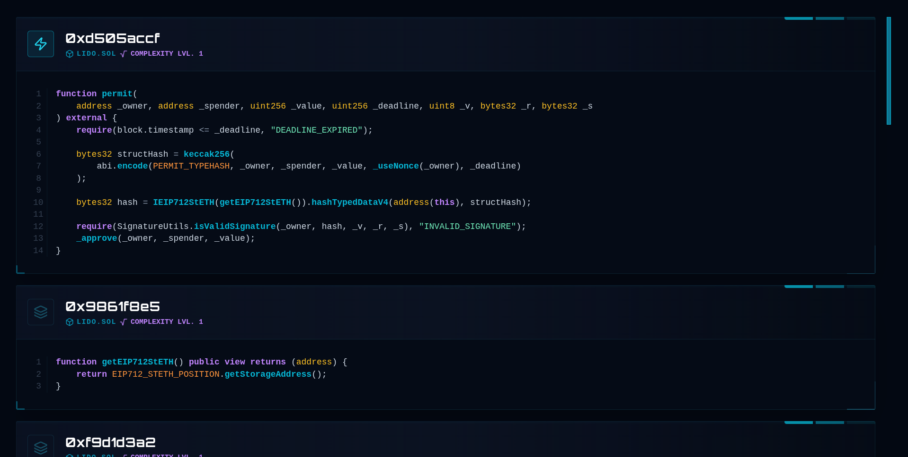
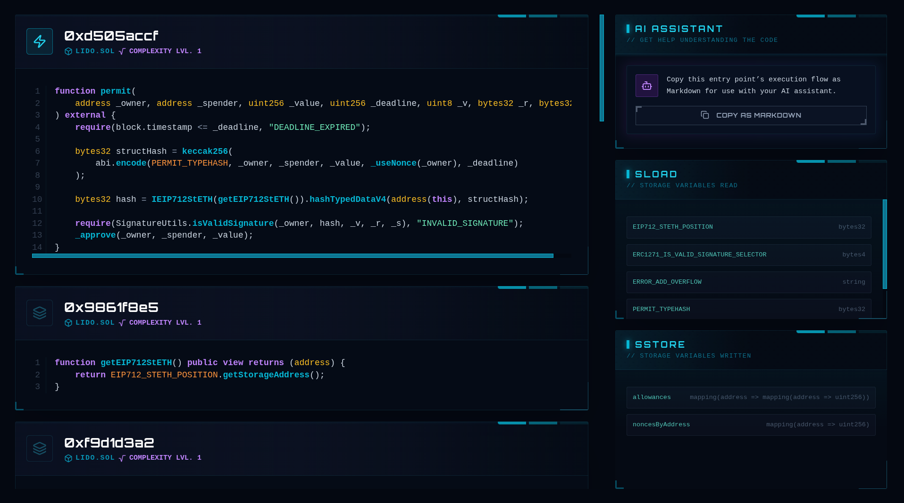
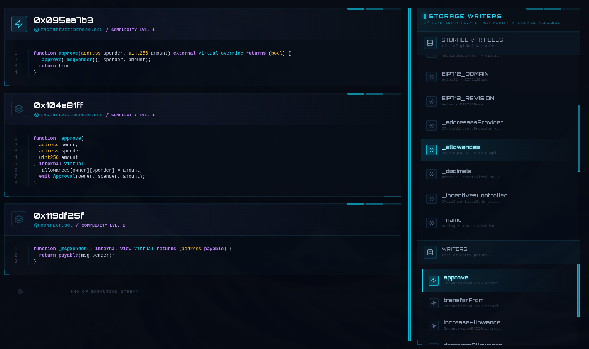
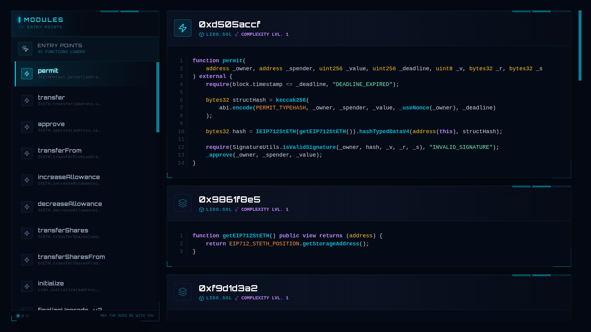
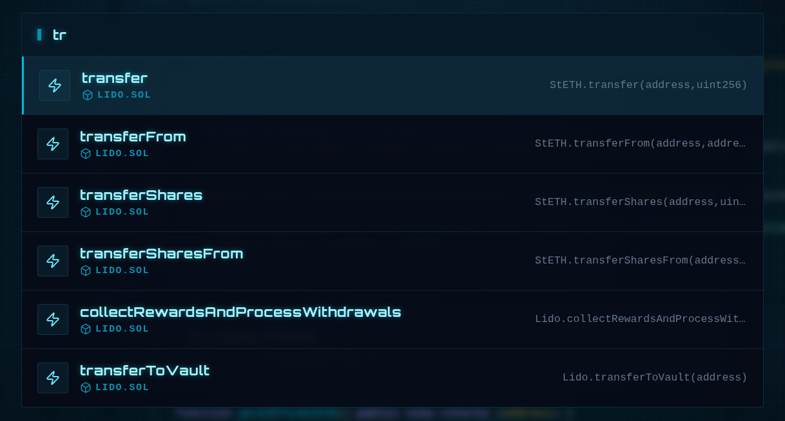
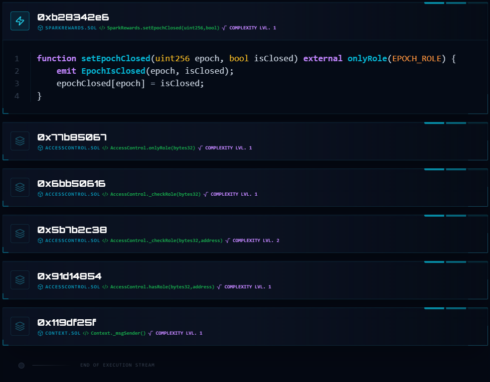

# 🧪 OnboardMe (Experimental)

Below is a short user interface walkthrough, starting from the homepage, then typing `mainnet:0x..smart-contract-address` to visit a smart contract, and navigating its entry points:

<https://github.com/user-attachments/assets/fc6cabcb-f3c2-4335-88d0-a79dde1187a2>

> ⚠️ Highly experimental. It may fail on some contracts, compilers, or Slither versions. Expect sharp edges.
>
> ⚠️ The videos and images in this README.md file will differ from the actual interface, as we add features faster than we update the images in the README.

Jumping between files and tabs isn’t a great way to study an entry point in a Solidity smart contract.

Ideally, you want one scrollable view showing every internal function and state variable the entry point touches.

OnboardMe gives you that. By default, press j to jump to the next entry point (no matter where it’s defined) while keeping the entire flow in view.

It doesn’t replace your IDE; it’s just the fastest way to understand all possible execution paths, so you can dive deeper with your IDE when needed.

> **Tip**: Press **?** for a list shortcuts. OnboardMe was designed for a keyboard-centric workflow and most features can only be triggered from a shortcut. Shortcuts are configurable in `src/hotkeys.json`.

## ✨ Features

- 🧵 Single scrollable execution flow per entry point, including internal calls
- ⌨️ Keyboard-centric navigation (`j`/`k` for entry points, `e` search, `r` right panel, `w` storage dependencies)
- 🧭 Left entry-point list, center execution flow, right storage read/write panel
- 🔎 Storage dependency panel to trace writers for a selected storage variable
- ⚙️ Configurable hotkeys and help overlay via `src/hotkeys.json`
- ✅ Audit marks with a filter to focus on audited entry points
- 📦 Collapsible function blocks with persisted state and synced collapse across identical code
- 📋 Chain- and address-aware header with copy-to-clipboard hotkey
- 🧭 Open contract in a block explorer via hotkey
- 🔗 Chain name or chain ID input support (`chain:0x...`) with validation
- 🛠️ Local UI + API (`/generate`) and CLI generation (`python main.py`)

## 🧩 Understand the UI layout

### 🎯 Center

The center section of the screen has the currently selected entry point, with all the internal functions it executes, in a scrollable page.



### ➡️ Right

Pressing `r` toggles the visibility of the right panel, which contains every global variable read/written during the execution of this entry point.



Pressing `w` toggles a data dependency panel that lets you list all possible ways to modify a specific storage variable, either directly or indirectly.



### ⬅️ Left

Pressing `l` toggles the visibility of the left panel, which contains every entry point. By default, you can switch between entry points by clicking on them or by pressing `j`/`k` for next and previous.



### 🔍 Search

Press `e` to fuzzy-find entry points.



### ⌨️ Shortcuts

Press `?` for a list of shortcuts (configurable via `src/hotkeys.json`).

### 🪄 Toggle functions

Click the header of a function to collapse its code.

Folded code persists across contracts, so identical functions stay collapsed.

This is especially useful for common modifiers like `onlyRole` and other repeated patterns across contracts, helping you focus on what matters.



### 🧩 Hotkeys configuration

Edit `src/hotkeys.json` to customize shortcuts and the help popup. Each action maps to one or more key combos.

```json
{
  "actions": {
    "nextEntry": ["j"],
    "prevEntry": ["k"],
    "toggleAuditFilter": ["h"]
  },
  "help": [
    {"action": "nextEntry", "label": "Next entry point"},
    {"action": "prevEntry", "label": "Previous entry point"}
  ]
}
```

> There are many more hotkeys in src/hotkey.json

**We strongly encourage you to press "?" and read the list of shortcuts**, because **some features are hidden from the UI** and can only be triggered from a hotkey.

## 🚀 Quick start (recommended UI flow)

Create a file named `.env` and add your ETHERSCAN_API_KEY:

```env
ETHERSCAN_API_KEY=...
```

Requires **Python 3.10 or newer**.

```bash
# 1) Create a venv (recommended)
python3 -m venv .venv
source .venv/bin/activate

# 2) Install dependencies (Slither + its deps)
pip install slither-analyzer

# 3) Start the local UI + API
python serve.py --host 127.0.0.1 --port 8000
```

Open `http://127.0.0.1:8000/` and **type a contract address** to generate and view the dashboard.

> You won't find a large text input box in the center of the screen to click; that's a design choice. Just type the chain id or name using your keyboard, then press the Paste hotkey if you have the smart contract address already copied to your clipboard. The text will be displayed on the page as you type.

Input formats supported by the UI:

- `0x...` (defaults to `mainnet`)
- `chain:0x...` (example: `mainnet:0x...` or `1:0x...`)

## 🌐 Supported chains

You can use either the chain name or the chain id anywhere a chain is accepted
(CLI, API, or `chain:0xaddress` input).

| Chain name | Chain id |
| --- | --- |
| mainnet | 1 |
| sepolia | 11155111 |
| holesky | 17000 |
| hoodi | 560048 |
| bsc | 56 |
| testnet.bsc | 97 |
| poly | 137 |
| amoy.poly | 80002 |
| base | 8453 |
| sepolia.base | 84532 |
| arbi | 42161 |
| nova.arbi | 42170 |
| sepolia.arbi | 421614 |
| linea | 59144 |
| sepolia.linea | 59141 |
| blast | 81457 |
| sepolia.blast | 168587773 |
| optim | 10 |
| sepolia.optim | 11155420 |
| avax | 43114 |
| testnet.avax | 43113 |
| bttc | 199 |
| testnet.bttc | 1029 |
| celo | 42220 |
| sepolia.celo | 11142220 |
| frax | 252 |
| hoodi.frax | 2523 |
| gno | 100 |
| mantle | 5000 |
| sepolia.mantle | 5003 |
| memecore | 43521 |
| moonbeam | 1284 |
| moonriver | 1285 |
| moonbase | 1287 |
| opbnb | 204 |
| testnet.opbnb | 5611 |
| scroll | 534352 |
| sepolia.scroll | 534351 |
| taiko | 167000 |
| hoodi.taiko | 167013 |
| era.zksync | 324 |
| sepoliaera.zksync | 300 |
| xdc | 50 |
| testnet.xdc | 51 |
| apechain | 33139 |
| curtis.apechain | 33111 |
| world | 480 |
| sepolia.world | 4801 |
| sophon | 50104 |
| testnet.sophon | 531050104 |
| sonic | 146 |
| testnet.sonic | 14601 |
| unichain | 130 |
| sepolia.unichain | 1301 |
| abstract | 2741 |
| sepolia.abstract | 11124 |
| berachain | 80094 |
| testnet.berachain | 80069 |
| swellchain | 1923 |
| testnet.swellchain | 1924 |
| testnet.monad | 10143 |
| hyperevm | 999 |
| katana | 747474 |
| bokuto.katana | 737373 |
| sei | 1329 |
| testnet.sei | 1328 |

## 🧰 Generate via CLI (optional)

```bash
# Generate a dashboard for a contract
python main.py <ADDRESS> <CHAIN>

# Example (defaults are baked in if you omit args)
python main.py
```

The output HTML is written to `src/<chain>_<address>.html`.

## 🔌 API (used by the UI)

`GET /generate?address=<ADDR>&chain=<CHAIN>`

`POST /generate` with either:

- JSON: `{"address":"0x...","chain":"mainnet"}`
- Form‑encoded: `address=0x...&chain=mainnet`

Response:

```json
{
  "status": "ok",
  "file": "mainnet_0x....html",
  "url": "/mainnet_0x....html",
  "contracts": ["ContractA", "ContractB"]
}
```

## Contributing

Issues and PRs are welcome. If you hit a failure, please include:

- Contract address + chain
