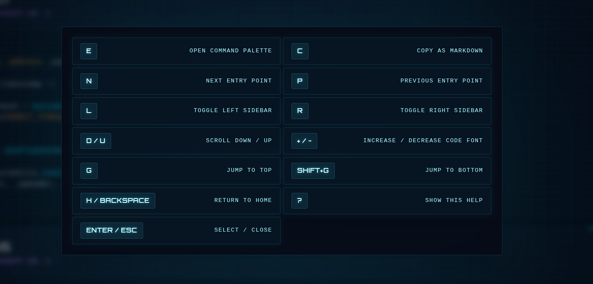

# OnboardMe (Experimental)

> ⚠️ This is a highly experimental tool. It may fail on some contracts, compilers, or Slither versions. Expect sharp edges.

Jumping between multiple files (contracts and libraries) is not the easiest way to study the execution flow of a Solidity smart contract.

Ideally, a security researcher should see every internal function and global variable touched by an entry point on a single, scrollable page.

OnboardMe does exactly that. With a single keypress (n), you move from one entry point to the next—regardless of where it’s implemented—while viewing all related internal functions and state in one place.

OnboardMe is the fastest way to understand complex Solidity smart contracts.

It does not replace IDEs. Instead, it helps you build a high-level mental model first, so you can later dive deeper with your IDE when needed.

> Tip: Press **?** for a list shortcuts. OnboardMe was designed for a keyboard-centric workflow.

## Understand the UI

### Center

The center section of the screen has the currently selected entry point, with all the internal functions it executes, in a scrollable page.


### Right

Pressing `r` toggles the visibility of the right panel, which contains every global variable read/written during the execution of this entry point.


### Left

Pressing `l` toggles the visibility of the left panel, which contains every entry point. You can switch between entry points by clicking on them or by pressing `n`/`p` for next and previous.


### Search

Press `e` to fuzzy-find entry points.


### Shortcuts

Press `?` for a list of shortcuts.



## Quick start (recommended UI flow)

```bash
# 1) Create a venv (recommended)
python3 -m venv .venv
source .venv/bin/activate

# 2) Install dependencies (Slither + its deps)
pip install slither-analyzer

# 3) Start the local UI + API
python serve.py --host 127.0.0.1 --port 8000
```

Open `http://127.0.0.1:8000/` and **type a contract address** to generate and view the dashboard.

Input formats supported by the UI:

- `0x...` (defaults to `mainnet`)
- `chain:0x...` (example: `mainnet:0x...`)

The `chain` value uses the same network naming format that Slither accepts.

## Generate via CLI (optional)

```bash
# Generate a dashboard for a contract
python main.py <ADDRESS> <CHAIN>

# Example (defaults are baked in if you omit args)
python main.py
```

The output HTML is written to `src/<chain>_<address>.html`.

## API (used by the UI)

`GET /generate?address=<ADDR>&chain=<CHAIN>`

`POST /generate` with either:

- JSON: `{"address":"0x...","chain":"mainnet"}`
- Form‑encoded: `address=0x...&chain=mainnet`

Response:

```json
{
  "status": "ok",
  "file": "mainnet_0x....html",
  "url": "/mainnet_0x....html",
  "contracts": ["ContractA", "ContractB"]
}
```

## Configuration

Create a file named `.env` and add your ETHERSCAN_API_KEY:

```env
ETHERSCAN_API_KEY=...
```

## Project layout

```
.
├─ main.py         # CLI generator for a single contract HTML
├─ serve.py        # HTTP server + /generate API
├─ template.html   # UI template with embedded flow data
└─ src/            # UI entrypoint (index.html) + generated dashboards + registry.json
```

## Contributing

Issues and PRs are welcome. If you hit a failure, please include:

- Contract address + chain
